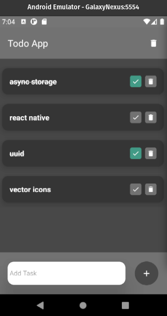

<p align="center">
  
</p>

<p align='center'> simples app<p/>

<p align="center">
  <a href="#-projeto">Projeto</a>&nbsp;&nbsp;&nbsp;|&nbsp;&nbsp;&nbsp;
   <a href="#-Tecnologias">Tecnologias</a>


<p align="center">
 

  
</p>

<br>


## 🚀 Tecnologias

Esse projeto foi desenvolvido com as seguintes tecnologias:

- java script [ecma6]
- react
- react-native
- uuid
- async storage

## 💻 Projeto

O projeto sera um app To do, projeto simples, sem licença, fique a vontade.


# :wrench: How To Run
To run this app on your computer, run these commands inside the repository app folder

```shell
#  install dependencies, run :
$ npm

# start 
$ npm start

# after open avd in  android studio 
$ npm run android

```
---
